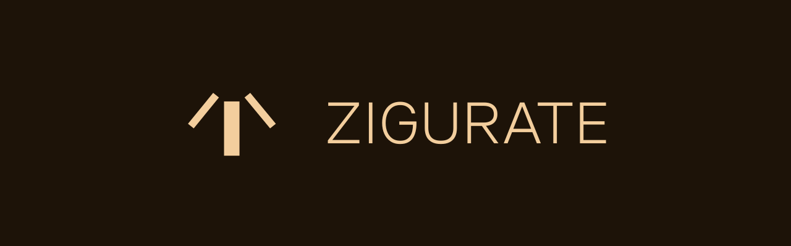

# Zigurate Lang

> Created specifically for my personal worldbuilding use. If you have patient to use it for your world, be free.

*A Executable Specification Language for Game designers, writters and worldbuilders, designed in **Rust***.





```zi
silim("Hello World!")
```


## What's Zigurate?

I designed it to speed-up my large worldbuilding search, I have a lot of characters, artifacts, items and others. With Zigurate, I can organize my world and search for what I want to find.


## Documentation

> Coming soon.


## Download

### Github Releases (.zip)

1. Go to [Releases](https://github.com/G4brielXavier/ZigurateLang/Releases)
2. Choice your version and install the *enki_installer-URX.zip*
3. After, extract the `.zip`.
4. Click two times in `install.bat`
5. Close the terminal opened and test with `enki --version`

<!-- ### Cargo

If you have Rust Cargo in you PC, follow this:
1. Open your terminal
2. Execute: `cargo install zigurate-lang`
3. To test: `enki --version` -->


## LICENSE

**MIT Licence -** [Read here](./LICENSE)